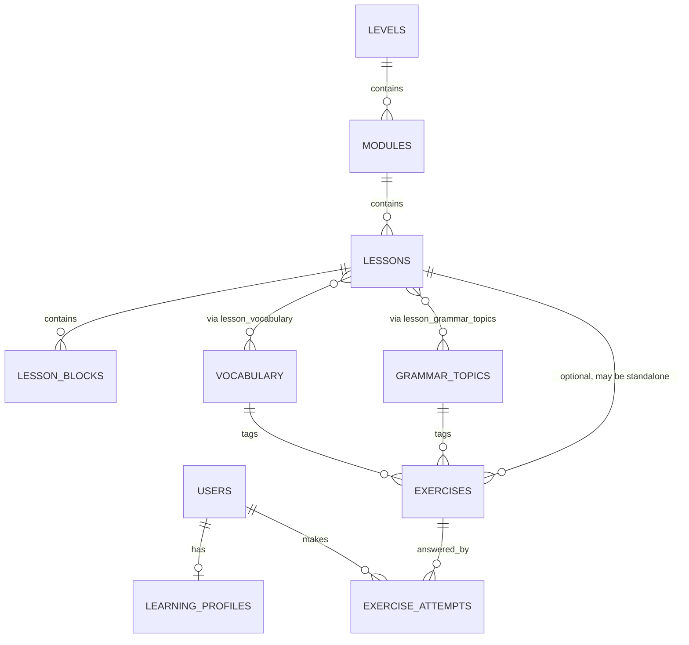

# Database Schema — Phase 0 Proposal

Scope: only the entities needed through Phase 3.5 (placement test). `UserMistake`, `ReviewItem`, `UserVocabulary`, `Homework`, `SpeakingSession` are deferred to Phase 4/5 and deliberately left out — adding them now would be guessing at shapes before the features that need them exist.

## Entity-relationship overview

## Entities

### `users`
Owns authentication identity. Nothing else.

| Column | Type | Notes |
|---|---|---|
| id | UUID PK | |
| email | text, unique, not null | |
| password_hash | text, not null | never plaintext |
| created_at | timestamptz, default now() | |

### `learning_profiles`
Owns personalization state: per-skill CEFR level and priority goals. **This is the multi-user hook** — every future user gets their own row here instead of code branching on "the" user.

| Column | Type | Notes |
|---|---|---|
| id | UUID PK | |
| user_id | UUID FK → users.id, unique, on delete cascade | 1:1 with user |
| level_grammar / level_vocabulary / level_reading / level_listening / level_speaking / level_writing | enum(A1,A2,B1,B2), nullable | filled by placement test; null until then |
| priority_goals | JSONB, ordered array | e.g. `["travel", "conversation", "listening_content", "work_it"]` — ordered list, not a join table (see *Deferred normalization* below) |
| placement_completed_at | timestamptz, nullable | |
| created_at / updated_at | timestamptz | |

### `levels`
CEFR levels: A1, A2, B1, B2 only — no C1/C2 per CLAUDE.md.

| Column | Type | Notes |
|---|---|---|
| id | UUID PK | |
| code | text, unique | `A1`\|`A2`\|`B1`\|`B2`, CHECK constraint |
| order_index | int, unique | display/progression order |

### `modules`
| Column | Type | Notes |
|---|---|---|
| id | UUID PK | |
| level_id | FK → levels.id, on delete restrict | content is never silently wiped by a level edit |
| slug | text, unique | |
| title | text | |
| order_index | int | unique together with level_id |

### `lessons`
| Column | Type | Notes |
|---|---|---|
| id | UUID PK | |
| module_id | FK → modules.id, on delete restrict | |
| slug | text, unique | |
| title | text | |
| order_index | int | unique together with module_id |
| content_path | text | source file under `content/`, for traceability from DB row back to the authored file |

### `lesson_blocks`
One row per block inside a lesson (goals/context/vocabulary/grammar/examples/exercises/reading/listening/speaking/homework/review).

| Column | Type | Notes |
|---|---|---|
| id | UUID PK | |
| lesson_id | FK → lessons.id, on delete cascade | a block has no meaning outside its lesson |
| block_type | enum | one of the eleven block types from CLAUDE.md's Lesson Model |
| order_index | int | unique together with lesson_id |
| content | JSONB | shape depends on `block_type`; validated at content-load time, not by the DB |

### `vocabulary`
| Column | Type | Notes |
|---|---|---|
| id | UUID PK | |
| headword | text, indexed | |
| translation | text | |
| example_sentence | text | |
| audio_url | text, nullable | |

### `grammar_topics`
| Column | Type | Notes |
|---|---|---|
| id | UUID PK | |
| slug | text, unique | e.g. `present-simple-questions` — this is what mistake tracking in Phase 4 will key off |
| title | text | |
| description | text | |

### `lesson_vocabulary`, `lesson_grammar_topics`
Plain association tables, composite PK on both FKs, `on delete cascade` from the lesson side only (removing a lesson removes the association, not the vocabulary/topic itself).

### `exercises`
Deliberately not scoped to one lesson: the same table serves lesson practice, the placement-test bank, and (Phase 4) spaced-repetition review, distinguished by `is_placement_item` and by how `exercise_attempts.source` records where an attempt came from.

| Column | Type | Notes |
|---|---|---|
| id | UUID PK | |
| lesson_id | FK → lessons.id, nullable, on delete restrict | null for placement-bank-only items |
| exercise_type | enum | `multiple_choice`, `single_choice`, `fill_blank`, `sentence_ordering`, `matching`, `translation`, `error_correction`, `reading_comprehension`, `listening_comprehension`, `dictation`, `writing`, `speaking` — full CLAUDE.md list even though Phase 3 only implements four of them |
| skill | enum(grammar, vocabulary, reading, listening, writing, speaking) | needed so the placement test can score per skill |
| difficulty | enum(A1,A2,B1,B2) | independent from the lesson's nominal level, so the placement bank can span levels |
| prompt | JSONB | question content, media refs |
| answer_key | JSONB | correct answer(s); shape depends on `exercise_type` |
| explanation | text | |
| grammar_topic_id | FK → grammar_topics.id, nullable, on delete set null | |
| vocabulary_id | FK → vocabulary.id, nullable, on delete set null | |
| is_placement_item | boolean, default false | |

Indexes: `(skill, difficulty)` for placement-bank queries, `(lesson_id)` for lesson practice.

### `exercise_attempts`
The only table that grows without bound — one row per submitted answer.

| Column | Type | Notes |
|---|---|---|
| id | UUID PK | |
| user_id | FK → users.id, on delete cascade | attempts are personal data, deleted with the user |
| exercise_id | FK → exercises.id, on delete cascade | an attempt is meaningless without the exercise it answers |
| submitted_answer | JSONB | |
| is_correct | boolean | |
| score | numeric, nullable | partial credit for types that support it |
| source | enum(lesson_practice, placement_test, review) | lets one table serve all three flows |
| attempted_at | timestamptz, default now() | |

Indexes: `(user_id, exercise_id)`, `(user_id, source)`.

## Cascade summary

- Deleting a **user** cascades to `learning_profiles` and `exercise_attempts` — personal data disappears with the account.
- Deleting **content** (`levels`/`modules`/`lessons`) is `RESTRICT`, not cascade — content deletion is an authoring operation, not something that should silently take attempt history down with it. MVP has no UI for deleting content; this is a safety default, not a feature.
- `exercises.lesson_id` is nullable specifically so placement-bank items don't need a throwaway lesson to hang off of.

## Deferred normalization (documented assumption)

`learning_profiles.priority_goals` is a JSONB ordered list instead of a `learning_profile_goals` join table. With a fixed, small vocabulary of goals (`travel`, `work_it`, `conversation`, `listening_content`, …) and a single-digit number of users, a join table buys queryability we don't need yet at the cost of a migration and a join on every profile read. Revisit if goals ever need their own metadata (icons, descriptions) or cross-user aggregation ("how many users prioritize travel").

## Out of scope for this schema (Phase 4/5)

`UserMistake`, `ReviewItem`, `UserVocabulary`, `Homework`/`HomeworkAttempt`, `SpeakingSession`/`SpeakingMessage` — each depends on a feature (mistake classification, spaced repetition, AI homework, speaking flow) that doesn't exist yet. Designing their tables now would mean guessing; they get designed at the start of the phase that implements them.
